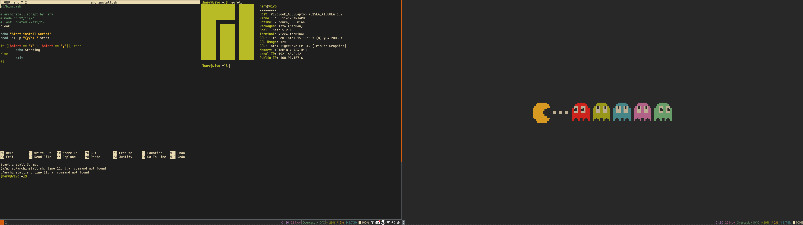

# arch-dotfile-install
Install script with custom dotfiles


#### DIY
Use [yay](https://github.com/Jguer/yay) to download and build from AUR. Or [append multilib repo to pacman.conf](https://wiki.archlinux.org/title/official_repositories).
```bash
yay -S i3-gaps i3blocks xfce4 xbanish pa-applet network-manager-applet xbacklight rofi thunar nano-syntax-highlighting xfce4-screenshooter
```
Clone repo and move config files respectively
```bash
git clone https://github.com/harvooo/arch-dotfile-install.git &&
cd arch-dotfile-install
```
## Desktop
- i3-gaps
- i3blocks
- xfce-polkit
- xbanish (hide cursor when typing)
- pa-applet
- nm-applet
- feh (background rendering)
- xbacklight
- rofi (with gruvbox theme)
- thunar

## Other configuration files
- bashrc (manjaro)
- nanorc
- i3 config
- pacman
- rofi
- i3blocks

## Extra dependencies
- nano-syntax-highlighting
